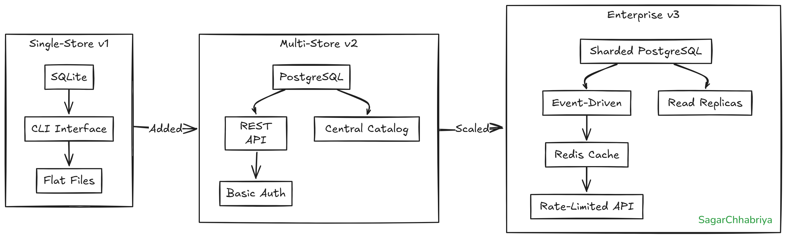

### Directory Structure

```
bazaar-tech/
├── assets/
├── stage-01-sqlite/
│   ├── app.py
│   └── inventory.sqlite
├── stage-02-postgres/
│   ├── app.py
│   ├── requirements.txt
│   └── database.py
├── stage-03-scalable/
│   ├── app.py
│   ├── db.py
│   ├── requirements.txt
├── .gitignore
└── README.md
```


# Bazaar Inventory System Submission

## Design Decisions

1. **Database Architecture**
   - Stage 1: SQLite for simplicity
   - Stage 2: PostgreSQL with store-specific inventory
   - Stage 3: Read replicas + Redis cache

2. **API Design**
   - RESTful endpoints with HTTP status codes
   - Consistent resource naming (/products, /stores/{id}/inventory)
   - JSON responses with error details

3. **Scalability**
   - Connection pooling (SQLAlchemy)
   - Redis caching for high-frequency reads
   - Celery for async write operations

## Key Assumptions

1. **Business Rules**
   - Negative stock prevented at application level
   - Stores sync inventory nightly if offline
   - 99.9% read availability target

2. **Technical Constraints**
   - Redis available for caching
   - PostgreSQL with read replicas in Stage 3

## API Specification

### Stage 2+ Endpoints
```
POST /products - Add new product
POST /stores/{id}/stock - Update inventory
GET /inventory/{store_id} - Get current stock
POST /movements - Record stock movement
```

## Evolution Rationale



### Stage 1 → Stage 2
- **Change**: SQLite → PostgreSQL
- **Reason**: Multi-store support needing transactions
- **Trade-off**: Added deployment complexity

### Stage 2 → Stage 3
- **Change**: Monolithic → Cached+Async
- **Reason**: Handle 1000+ stores with low latency
- **Trade-off**: Eventual consistency for writes
```
